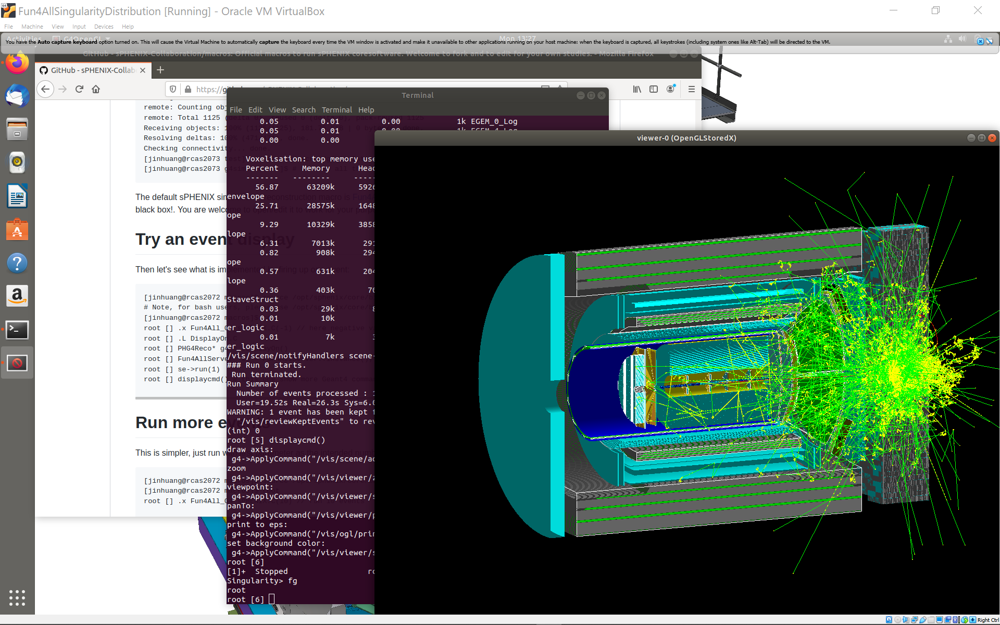

# Using sPHENIX and EIC-sPHENIX software with an Ubuntu Virtual Box

[Singularity container](./README.md) for sPHENIX and EIC-sPHENIX allow collaborators to run sPHENIX RCF/SDCC environment with the nightly builds on your local computers or on external high-performance computing clusters. It is optimized for offsite computing on Linux-based systems. 

On Windows or MacOS PC/laptop though, it could be tricky to run Singularity directly on the host system. Therefore, this page provide a solution to run sPHENIX Singularity container under an Linux Ubuntu [virtual box](https://www.virtualbox.org/wiki/Downloads), which can run well on Windows or MacOS. 

1. Install VirtualBox on your host system: [Virtual Box](https://www.virtualbox.org/)

2. Download [sPHENIX Ubuntu 18.04LTS Image](https://www.phenix.bnl.gov/WWW/publish/phnxbld/sPHENIX/Singularity/Fun4AllSingularityDistribution.ova). The MD5SUM is `87a6464dbae831724bc9eb3b508f2646`.

This image has CVMFS and Singularity3 preinstalled, enabling direct loading all sPHENIX builds via OpenScienceGrid network (i.e. Option-1 of [main documentation](/README.md)).   

3. Import the above image to your virtual box ([HowTs](https://www.google.com/search?q=Virtal+box+import+ova)). Please ensure you have internet connection before the next step (e.g. visit www.bnl.gov from inside the VirtualBox)

Then you are good to go. Start the imported Virtual Box. The default user is `fun4all` with password of `fun4all`. It would be good practice to [change at least the password](https://www.google.com/search?q=ubuntu+howto+change+password) after first login. Following files are installed in the home folder: 
* `~/singularity_shell.sh`: execute this script to get a bash shell with the Singularity container
* `~/setup.sh`: source this macro from inside the Singularity container to use the lastest build 
* `~/install/`: local build folder to be used for `$MYINSTALL` area, which is currently empty

Start using it with an Ubuntu terminal:
```
fun4all@Fun4AllSingularity:~$ ./singularity_shell.sh
entering sPHENIX singularity container on /cvmfs/sphenix.opensciencegrid.org

Singularity> source setup.sh 
.....
Using sPHENIX build at /cvmfs/sphenix.opensciencegrid.org/x8664_sl7/release/release_new/new.2
Local build will be installed at /home/fun4all/install

Singularity> git clone https://github.com/sPHENIX-Collaboration/macros.git
Cloning into 'macros'...
...

Singularity> cd macros/macros/g4simulations/
Singularity> root Fun4All_G4_sPHENIX.C
   ------------------------------------------------------------
  | Welcome to ROOT 6.16/00                  https://root.cern |
...
```
Then welcome to follow the default macro tutorials: https://github.com/sPHENIX-Collaboration/macros . 

Please note the first use of a day will be slow, as CVMFS caches files from BNL SDCC over the network. You are also welcome use [Option-2 downloading a build and run the software without internet](/README.md#option-2-download-sphenix-build-via-https-archive). 


